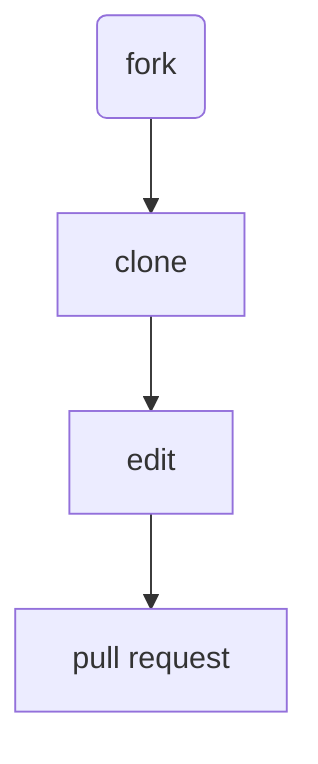

# First Contributions

This project aims to simplify and guide the way beginners make their first contribution. If you are looking to make your first contribution, follow the steps below.

**What all you will be doing?**




#### If you don't have git on your machine, [install it](https://docs.codeberg.org/getting-started/install-git/). <br>

## Fork this repository

Fork this repository by clicking on the fork button on the top of this page.
This will create a copy of this repository in your account.


## Clone the repository


Now clone the forked repository to your machine. Go to your Codeberg account, open the forked repository and then click the _copy to clipboard_ icon.


Open a terminal/git bash and run the following git command:

```bash
git clone "url you just copied"
```

where "url you just copied" (without the quotation marks) is the url to this repository (your fork of this project). See the previous steps to obtain the url.


For example:

```bash
git clone git@codeberg.org:your-username/First_Contributions.git
```

where `your-username` is your Codeberg username. Here you're copying the contents of the first-contributions repository on Codeberg to your computer.


## Make necessary changes and commit those changes

Now open `Contributors.md` file in your preffered text editor, add your name to it. Don't add it at the beginning or end of the file. Put it in sequence with indentation followed. (You will see instructions in the file itself)
 


Now save the file


If you go to the project directory using `cd` command and execute the command `git status`, you'll see there are changes.


Add those changes to the branch you just created using the `git add` command:

```bash
git add Contributors.md
```

Now commit those changes using the `git commit` command:

```bash
git commit -m "First Commit"
```


You can type anything in place of "First Commit" it is just to track what commit you made like a comment

## Push changes to GitHub

Push your changes using the command `git push`:

```bash
git push -u origin main
```


In this project you will be just using main branch but in other projects replace `main` with the name of the branch you created.


<strong>If you encounter any errors while pushing, please search for the error message online for potential solutions. Otherwise, reach out to your friends for help or create an issue to seek assistance.</strong>


## Submit your changes for review

If you go to your repository on Codeberg, you'll see a `Pull request` button. Click on that button.


Now submit the pull request.


<br>


<br>Soon I'll be merging all your changes into the main branch of this project. You will get a notification email once the changes have been merged.


## Where to go from here?

Congrats! You just completed the standard _fork -> clone -> edit -> pull request_ workflow that you'll often encounter as a contributor!


Now let's get you started with contributing to other projects. This is a list of projects with different issues you can get started on. Check out ( https://www.codetriage.com/ )


For further reference check out <br>
    https://docs.codeberg.org/ <br>
    https://opensource.dev/